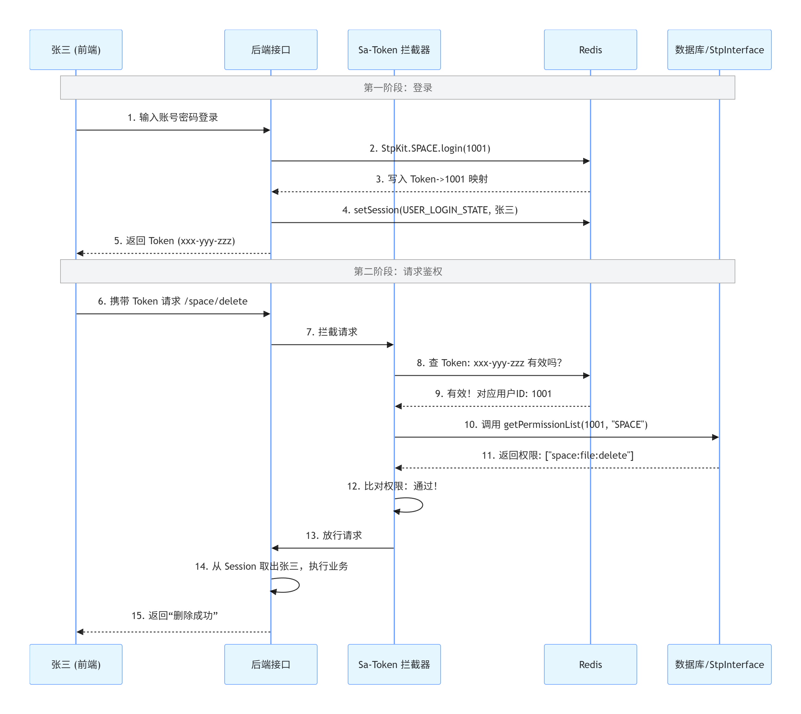

# 本次计划（前端）
+ 为图片增加可视化编辑功能

# 为项目增加团队空间

> 1 实现方案：通过为空间表添加是否为团队空间字段避免多次创建表

> 2 为项目添加统一的权限管理逻辑 
> + 添加权限相关的类
> + 引入Sa-Token进行权限校验，关联redis，将校验信息设置到redis中，并且引入序列化器和redis连接池
> + 新建团队空间账号体系
> + 确定给Sa-Token返回什么校验参数 权限列表还是角色列表
> + 我们在进行权限校验时需要拿到一些参数如：图片id/空间id 这些参数需要在校验权限时使用。
>   想想看我们需要给某个方法进行权限校验，权限校验逻辑需要在执行该方法之前进行，但是此时我们还不知道具体要对那个图片/空间进行校验
>   所以我们在方法校验前就拿到某些参数id
> + 注解鉴权（方便，但是无法在鉴权之前通过业务代码获取图片/空间 id）
> + 编程鉴权（麻烦，但是能够在业务中设置图片/空间id，不用从request中取请求参数id了）
> + 编写请求处理，用于将请求中的id获取出来，然后设置到SpaceUserAuthRequest中，并且要编写HttpServletRequestWrapper处理body流只能读取一次的问题
> + HttpServletRequestWrapper，在过滤器中用包装类处理request请求，将body中的流进行处理，保证项目中能够多次读取
> + 梳理返回给Sa-Token的权限校验参数，什么用户在请求什么空间时需要返回什么权限。
> + 为 getPermissionList 方法添加权限校验，并且要兼容 私有空间/公共空间/团队空间
> + 将StpInterface实现类交给Sa-Token管理，通过拦截器设置进去
> + 每因为涉及到多账户下的权限校验，所以我们需要通过注解设置权限校验对那个模式起作用。为了方便我们使用注解合并来简化注解
> + 注意：当我们登录成功后就需要将用户信息设置到空间权限校验中，生成对应的token信息存在redis中，下回再需要空间权限校验时就会将请求携带的token与我们存的token进行校验
> 
> + 使用注解合并，但是需要加配置类
> + 为图片接口，空间接口 使用我们设置的合并注解进行权限校验
> + 为了方便前端展示用户的权限，我们将权限列表返回给前端，方便其进行权限校验进而展示用户可操作行为
> + 需要再空间 + 图片 VO类中设置当前用户权限列表
> 
> 3 添加分表逻辑()
> 1. SpaceIdShardingAlgorithm (分片算法)：
> 角色：导航仪。
> 职责：拿到 SQL 里的 space_id=10，计算出应该去 picture_10 这张表。
> 2. DynamicShardingManager (动态表管理器)：
> 角色：地图更新器。
> 职责：在启动时或创建新空间时，告诉 ShardingSphere：“现在系统里有 picture、picture_1、picture_10 这些表了，你导航的时候只能选这几个”。

# 单独将 sa-token 整合过程提取出来，认真分析
## 1. 引入依赖
## 2. 角色权限关系表 【这里使用json来维护】
## 3. 编写通过角色获取权限的工具类
## 4. 封装对请求的解析逻辑，用来为用户权限上下文填充参数，方便我们后续基于这个对不同空间权限进行校验
## 5. 编写具体的空间校验逻辑（公共空间权限校验 + 私有空间权限校验 + 团队空间权限校验）
## 6. 编写 StpInterfaceImpl 实现类，将权限校验逻辑交给 Sa-Token 管理
> + 我们编写了 StpInterfaceImpl 这个实现类，并没有手动设置在 sa-token中，sa-token是如何知道要使用我们的
> + StpInterfaceImpl 还是 DefaultStpInterface 这个实现类的呢？ --> 因为如果有其他的就不会使用默认的
## 7. 注解合并，通过自定义合并注解简化代码编写，但是需要编写配置类
## 8. 对我们项目中需要进行权限校验的接口添加校验逻辑

# 前端添加团队页面 + 添加空间成员 + 根据空间成员权限展示对应可操作按钮
## 1. 添加新增团队空间页面
> 实现思路：根据跳转传递的路由参数type动态修改标题 + type+map映射返回给后端需要新增空间类型
## 2. 新增侧边栏 【并且解决了侧边栏 + 导航栏头部  一起高亮的错误】
> (使用set，将每个导航栏可以跳转的路径存起来，每次跳转前先判断是否是自己管的)
> (还有就是私有空间和团队空间 公用/space，导致无法高亮混淆  --  解决方案：通过path.name判断是团队空间还是私有空间)
## 3. 权限校验 【当前空间/图片 就当前用户所能使用的权限】
> 1. 空间详情页中每个图片下方的操作 【SpaceDetailPage <-使用- PictureList 需要通过父传子告诉当前用户在当前空间的权限】
> 2. 图片详情页右侧对图片的操作   【PictureDetailPage 需要限制每个用户对当前空间的操作权限，所以要引入一套判断逻辑】
## 4. 添加了一个空间成员管理页面
## 5. 注意：还有一点就是在跳转到私有空间的时候需要判断是否存在，中间引入了一个 my_space 进行判断是否有私有空间是否能够跳转
## 6. 以及解决了，后端的knifine4j有密码导致无法使用 openapi 对接后端接口 + 分页后多个空白页问题
> 分页后多个空白页：因为我们设置的pageSize大小是12，而pagination默认是10，但是我们没有在pagination中设置，就导致其按照10进行分页，导致多了一页

# websocket操作
